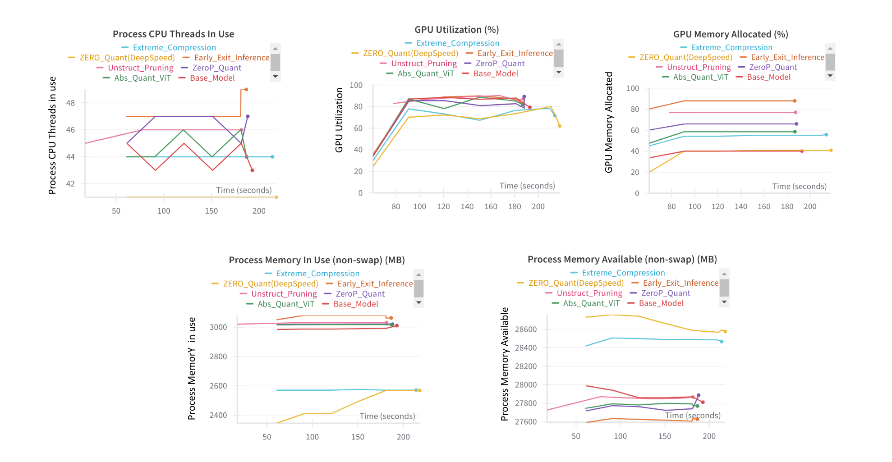

# Optimisation of Dynamic Neural Networks

## Overview

This project focuses on the optimization of dynamic neural networks. Dynamic neural networks adapt their structure based on the input data, improving efficiency and performance. This repository contains the code and analysis performed to evaluate different optimization techniques for these networks.

## Table of Contents

- [Overview](#overview)
- [Installation](#installation)
- [Usage](#usage)
- [Experiments and Results](#experiments-and-results)
  - [Understanding the LLMs](#understanding-the-llms)
  - [Observation : DistilBERT](#DistilBERT)
  - [Observation : Vision Transformer](#ViT)
  - [Observation : DeBERTa](#DeBERTa)

## Installation

To get started with this project, clone the repository and install the necessary dependencies.

```bash
git clone https://github.com/SalientPharaoh/Optimisation_of_dynamic_neural_networks.git
cd Optimisation_of_dynamic_neural_networks
pip install -r requirements.txt
```
To launch the front end, you need to install the necessary dependencies.

```bash
cd FrontEnd
npm install
```

## Usage

After installing the dependencies, you can run the main script to start the optimization process.

```bash
python app.py
```

This launches the Flask server.
To access the front end, navigate to the FrontEnd directory and start the Next.js application.

```bash
cd FrontEnd
npm run build
npm start
```

## Experiments and Results

### Understanding the LLMs 

The Project uses three distinct Large Language Models to understand the effect of optimisation techniques on them.

The LLMs used are as follows:


The Optimisation Techniques considered for analysis are as follows:
- **Weight & Activation Quantization**: Precise quantization for reduced model size and improved speed
- **SmoothQuant**: Enhanced quantization through smoothing distributions.
- **Advanced Model Pruning**: Removing redundant weights and neurons.
- **ZeRO Optimizer**: Utilizing DeepSpeed's ZeRO for significant memory reductions.
- **Mixed Precision (FP16)**: Accelerated training with reduced memory use.
- **Early Exiting**: Efficient inference by exiting when prediction confidence is high.
- **ZeroQuant**: ZeroQuant and Extreme compression under the Deepspeed optimisations.


### DistilBERT 

**Observation Table:**


**Inference and System Usage:**

- Inference metrics captured:


- System Resource utilisations during the inference time:


### ViT 

**Observation Table:**


**Inference and System Usage:**

- System Resource utilisations during the inference time:


### DeBERTa 

**Observation Table:**


**Inference and System Usage:**

- Inference metrics captured:


- System Resource utilisations during the inference time:




### FrontEnd:

